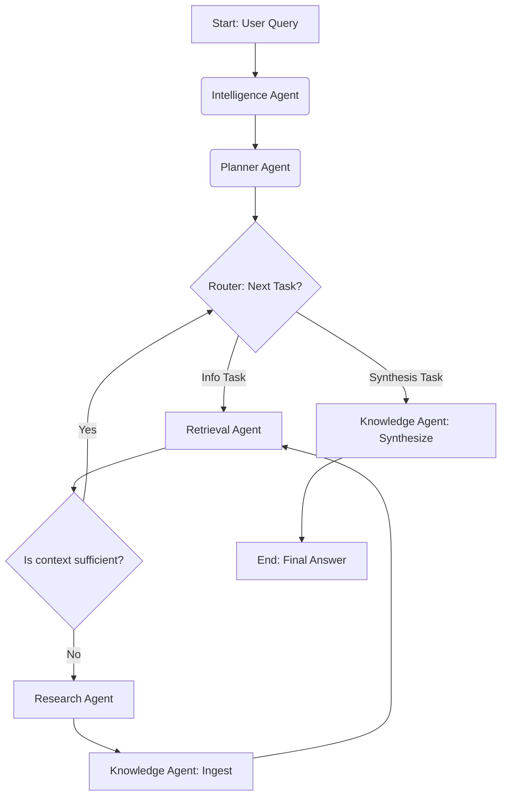

Of course. Here is a detailed plan for building the agent orchestrator for an autonomous RAG knowledge base system.

-----

## **Part 1: Foundational Architecture & Philosophy**

The system will be designed as a **stateful, cyclical multi-agent graph**. This architecture allows agents to work collaboratively, iteratively refining their results and handling complex tasks that require both
retrieving existing knowledge and researching new information. The orchestrator's primary role is not just to execute a linear chain of tasks but to intelligently route work between agents based on a shared, evolving
state.

* **Orchestration Engine:** We will use **LangGraph**. Its ability to define workflows as stateful graphs with nodes (agents) and conditional edges (decision-making logic) is perfectly suited for this autonomous system.
  It allows for loops, such as a research-and-retrieve cycle, which is critical for building a self-improving knowledge base.
* **State Management:** A central `AppState` object will be the "single source of truth" that is passed between agents. Each agent reads from this state and writes its output back to it. This object will be defined in
  `app/agents/core/` and will contain fields like:
    * `initial_query`: The original question from the user.
    * `plan`: A structured list of sub-tasks generated by the planner.
    * `task_history`: A log of completed tasks and their outcomes.
    * `retrieved_context`: A collection of documents and data retrieved from the vector store.
    * `research_notes`: Raw and summarized data gathered by the research agent.
    * `final_answer`: The synthesized response for the user.
* **Core Agent Framework (`app/agents/core/`):** To ensure modularity and a consistent interface, we'll establish an abstract base class, `BaseAgent`. Every agent in the system will inherit from this class, which will
  enforce a standard `execute(state: AppState) -> AppState` method. This makes agents interchangeable and simplifies the orchestration graph definition.

-----

## **Part 2: Agent Design & Responsibilities**

Each agent is a specialized worker with a clearly defined role. They interact with the outside world through the integrations defined in `app/integration/`.

### **1. Intelligence Agent**

* **Location:** `app/agents/intelligence/`
* **Primary Goal:** To analyze and understand the user's intent and to provide decision-making support to the orchestrator.
* **Responsibilities:**
    * **Query Analysis:** On receiving the initial query, it identifies key entities, determines the complexity, and classifies the user's intent (e.g., simple lookup, comparison, deep research).
    * **Routing Logic:** It acts as the brain for the orchestrator's conditional edges. For example, it will analyze the results from the `Retrieval` agent to decide if the information is sufficient or if the `Research`
      agent needs to be triggered.
    * **Plan Validation:** It can review the plan from the `Planner` to ensure it's logical and addresses the initial query.
* **Inputs:** `initial_query`, `retrieved_context`.
* **Outputs:** Enriched state with query analysis, routing decisions.
* **Core Tools:** A fast and capable LLM (via `app/integration/llm/`).

### **2. Planner Agent**

* **Location:** `app/agents/planner/`
* **Primary Goal:** To decompose a complex query into a structured, actionable plan.
* **Responsibilities:**
    * **Task Decomposition:** Breaks down the main query into a sequence of smaller, logical sub-tasks. For example, "Compare A and B" becomes -> "Research A," "Research B," "Synthesize comparison."
    * **Dependency Management:** Creates a directed acyclic graph (DAG) or a simple list of tasks that the orchestrator can execute in order.
* **Inputs:** `initial_query` and analysis from the `Intelligence` agent.
* **Outputs:** A structured `plan` object within the `AppState`.
* **Core Tools:** A powerful reasoning LLM (via `app/integration/llm/`).

### **3. Retrieval Agent**

* **Location:** `app/agents/retrieval/`
* **Primary Goal:** To fetch relevant information from the existing internal knowledge base. 🧠
* **Responsibilities:**
    * **Query Formulation:** Transforms a sub-task or query into optimized embedding vectors for searching.
    * **Vector Search:** Interfaces with the vector database to find the top-k most relevant documents.
    * **Re-ranking:** (Optional) Uses a re-ranking model to improve the relevance of the retrieved results before passing them on.
* **Inputs:** A sub-task description from the `plan`.
* **Outputs:** `retrieved_context` added to the `AppState`.
* **Core Tools:** Vector DB client (e.g., ChromaDB, FAISS) via `app/integration/vectordb/`.

### **4. Research Agent**

* **Location:** `app/agents/research/`
* **Primary Goal:** To find, scrape, and process new information from external sources when internal knowledge is insufficient. 🌐
* **Responsibilities:**
    * **Search Query Generation:** Creates effective search queries based on the sub-task.
    * **Web Search:** Executes searches using search engine APIs.
    * **Content Scraping:** Scrapes the content from the most promising URLs.
    * **Initial Processing:** Cleans the raw HTML and extracts the main textual content.
* **Inputs:** A sub-task description from the `plan`.
* **Outputs:** Raw `research_notes` added to the `AppState`.
* **Core Tools:** Search API (e.g., Tavily, DuckDuckGo) via `app/integration/search/` and a web scraping library (e.g., BeautifulSoup) via `app/integration/scraper/`.

### **5. Knowledge Agent**

* **Location:** `app/agents/knowledge/`
* **Primary Goal:** To synthesize information and enrich the internal knowledge base.
* **Responsibilities:**
    * **Information Curation:** Takes raw `research_notes` from the `Research` agent, summarizes them, extracts key facts, and prepares them for ingestion into the knowledge base.
    * **Knowledge Base Ingestion:** Chunks the curated information and uses the `VectorDB` integration to embed and store it for future retrieval. This is the core of the system's "autonomous" learning loop.
    * **Final Synthesis:** At the end of the workflow, it takes all `retrieved_context` and `research_notes` to generate the final, coherent answer for the user.
* **Inputs:** `retrieved_context`, `research_notes`.
* **Outputs:** Updates to the VectorDB, the `final_answer` in the `AppState`.
* **Core Tools:** A powerful LLM for summarization and synthesis (via `app/integration/llm/`) and the Vector DB client (via `app/integration/vectordb/`).

-----

## **Part 3: The Orchestration Workflow (`app/agents/orchestrator/`)**

The orchestrator, built with LangGraph, will wire these agents together. It won't contain agent logic itself, but rather the logic of *how to move between agents*.

**Conceptual Workflow Graph:**

1. **[Start] -> Intelligence Node:** The user query enters the graph and is first analyzed.
2. **Intelligence Node -> Planner Node:** The query is passed to the planner to create a step-by-step plan.
3. **Planner Node -> Router (Conditional Edge):** This is the main control loop. The router looks at the next task in the plan.
4. **Router Logic:**
    * **If the task requires synthesis (e.g., "summarize findings"):** Go to **Knowledge Node (Synthesis mode)**.
    * **If the task requires information:** Go to **Retrieval Node**.
5. **Retrieval Node -> Router (Conditional Edge):**
    * After retrieval, the `Intelligence` agent's logic is invoked to check if the retrieved context is sufficient.
    * **If sufficient:** The task is marked complete. Go back to the **Router** for the next task.
    * **If insufficient:** Go to the **Research Node**.
6. **Research Node -> Knowledge Node (Ingestion mode):** The new information is processed and added to the VectorDB.
7. **Knowledge Node (Ingestion mode) -> Retrieval Node:** The graph immediately re-tries the retrieval for the same task, this time with the newly added knowledge. This creates a powerful **Research -> Ingest ->
   Retrieve** loop.
8. **Knowledge Node (Synthesis mode) -> [End]:** Once the final task is complete, the `final_answer` is available in the state, and the graph execution finishes.

<!-- end list -->

-----

## **Part 4: Implementation Roadmap**

This project will be built in phases to ensure a stable and incremental development process.

* **Phase 1: Core Setup & Integrations (The "Plumbing")**

    * Set up the Conda environment using `environment.yml`.
    * Build the wrapper classes in `app/integration/` for the core open-source tools: an LLM (using Ollama for local models), and a VectorDB (ChromaDB).
    * Define the `AppState` data class and the `BaseAgent` abstract class in `app/agents/core/`.

* **Phase 2: Minimum Viable RAG (The "Backbone")**

    * Implement the `RetrievalAgent` to fetch from the VectorDB.
    * Implement the `KnowledgeAgent`'s synthesis capability.
    * Build a simple, linear orchestrator graph: **Query -> Retrieve -> Synthesize -> End**. Manually populate the VectorDB with a few documents to test the flow.

* **Phase 3: Adding Advanced Reasoning (The "Brain")**

    * Implement the `PlannerAgent` to break down queries.
    * Implement the `IntelligenceAgent` for basic query analysis.
    * Upgrade the orchestrator graph to handle multi-step plans generated by the planner, executing a retrieve-and-synthesize loop for each step.

* **Phase 4: Autonomous Research (The "Explorer")**

    * Build the search and scraper integrations in `app/integration/`.
    * Implement the `ResearchAgent`.
    * Implement the `KnowledgeAgent`'s ingestion capability.
    * Introduce the conditional routing logic to the orchestrator, enabling the system to decide when to use the `ResearchAgent` and enabling the self-improving ingestion loop.

* **Phase 5: Evaluation and Refinement**

    * Develop a suite of test queries (simple, complex, research-heavy).
    * Implement logging and tracing to monitor agent decisions and data flow.
    * Refine agent prompts, routing logic, and tool usage based on performance evaluation.
    * Refine agent prompts, routing logic, and tool usage based on performance evaluation.
